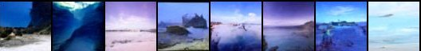
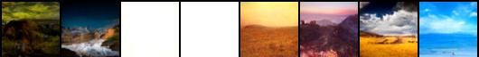

# Diffusion-Models-PyTorch
Implementing DDPM - Denoising Diffusion Probabilistic Models from scratch using PyTorch.

## Architecture Details

This implementation follows a U-Net structure with self-attention blocks as well as positional and time encodings.

There are 2 different variants in this project - Conditional and Unconditional. The conditional variant allows us to control the type of image generated based on labels. Hence, this variant of the model requires the labels to be embedded as well along with time. This variant was trained using the [CIFAR-10](https://www.cs.toronto.edu/~kriz/cifar.html) dataset. The unconditional variant was trained on the [Landscape](https://www.kaggle.com/datasets/arnaud58/landscape-pictures) dataset, and as expected we do not constrain the type of image generated using the trained model.

## Sample Output

Here are sample outputs after training the unconditonal variant model for 500 epochs.

Example-1  

  
Example-2  

## References
- [Denoising Diffusion Probabilistic Models](https://arxiv.org/pdf/2006.11239.pdf)
- [Improved Denoising Diffusion Probabilistic Models](https://arxiv.org/pdf/2102.09672.pdf)
